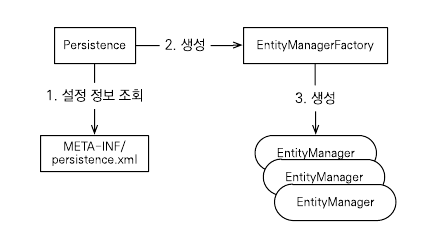
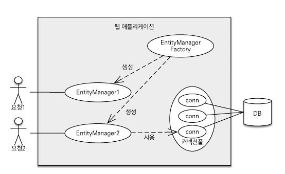
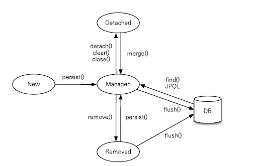
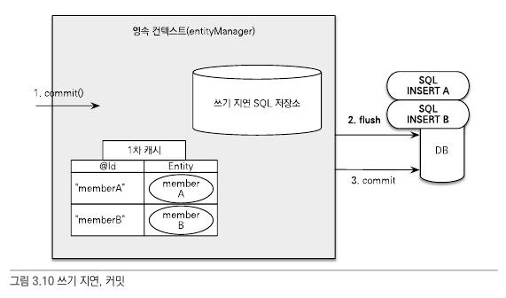
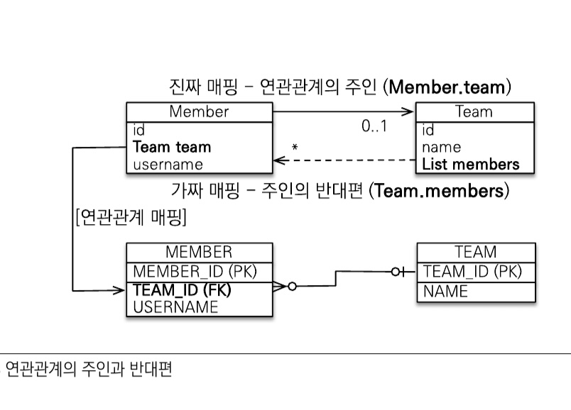
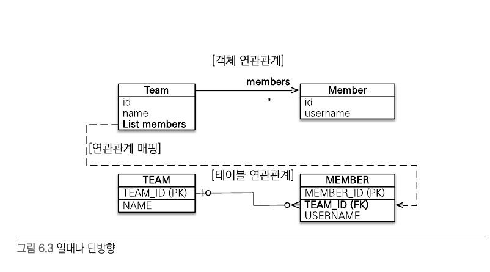
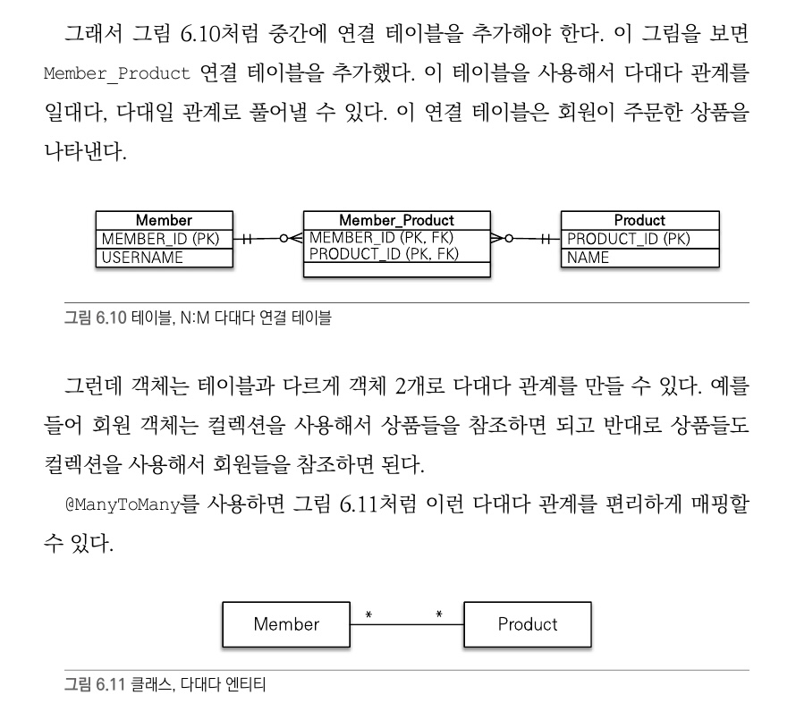
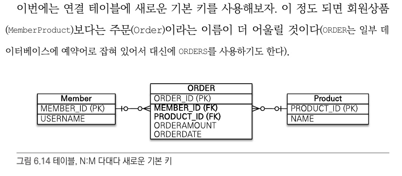
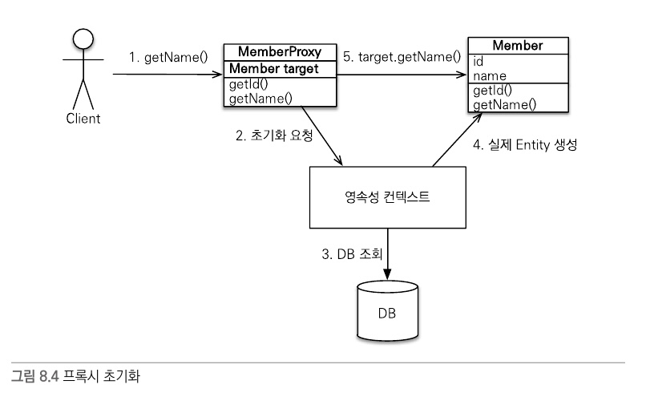

# 연관관계
- 객체는 참조를 사용해서 다른 객체와 연관관계를 가지고 참조에 접근해서 연관된 객체를 조회.
- 테이블을 외래키를 사용해서 다른 테이블과 연관관계를 가지고 조인을 사용해서 연관된 테이블을 조회.
- cf) 객체는 참조가 있는 방향으로만 조회 가능. 테이블은 외래키 하나로 양 방향 가능.
## 객체 그래프 탐색
- SQL을 직접 다루면 처음 실행하는 SQL에 따라 객체 그래프를 어디까지 탐색할 수 있는지 정해짐
- -> 비즈니스 로직에 따라 사용하는 객체 그래프가 다르기 때문에 언제 끊어질지 모르는 객체 그래프를 함부로 탐색하기 어려움
- 어디까지 객체 그래프 탐색이 가능한지 알아보려면 데이터 접근 계층인 DAO를 열어서 SQL을 직접 확인해야함.
```
member.getOrder().gerDeliver()... 객체 그래프 탐색 가능 ???
```
## JPA와 객체 그래프 탐색
- JPA를 사용하면 객체 그래프 마음껏 탐색 가능.   
- "SQL을 직접 다루면 처음 실행하는 SQL에 따라 객체 그래프를 어디까지 탐색할 수 있는지 정해"지기 때문에 
- -> 객체를 사용하는 시점에 적절한 SELECT SQL을 실행함. -> 연관된 객체를 신뢰하고 마음껏 조회 가능
- -> 실체 객체를 사용하는 시점까지 데이터베이스 조회를 미룬하고 해서 **"지연로딩"**이라고함.
```
//처음 조회 시점에 SELECDT MEMBER SQL 실행
Member member = jpa.find(Member.class, memberId);
Order order = member.getOrder();
order.getOrderDate(); // Order를 사용하는 시점에 SELECT ORDER SQL 실행
```
### 지연 로딩
- Member를 사용할 떄마다 Order를 함께 사용하면 위처럼 한테이블씩 조회하는 것보다 Member조회 시점에 SQL 조인사용하여 Member와 Order 함꼐 조회하는 것이 효과적!
- JPA는 연관된 객체를 즉시 함꼐 조회할지 아니면 실제 사용 시점에 지연해서 조회할지 간단한 설정으로 정의 가능.

## 비교
- 객체일 경우 인스턴스 다름
```
String memberId = "100";
Member member1 = MemberDAO.getMember(memberId);
Member member2 = MemberDAO.getMember(memberId);
// member1 != member2 
```
- **JPA는 같은 트랜잭션일 때 같은 객체가 조회되는 것을 보장**함 !
```
String memberId = "100";
Member member1 = jpa.find(Member.class, memberId);
Member member2 = jpa.find(Member.class, memberId);
// member1 == member2 
```

# JPA 설정
## persistence.xml
- JPA 설정은 영속성 유닛(persistence-unit)이라는 것부터 시작하는데 일반적으로 연결할 데이터베이스당 하나의 영속성 유닛을 등록.
## 엔티티 매니저 설정
### 엔티티 매니저 생성과정 

#### 1. 설정정보 조회 (Persistence -> META-INF/persistence.xml)
#### 2. 엔티티매니저팩토리 생성 (Persistence -> EntityManagerFactory)
- JPA 구현체에 따라서는 DB 커넥션 풀도 생성하므로 엔티티 매니저 팩토리 생성 비용 아주 큼
- 엔티티 매니저 팩토리는 애플리케이션 전체에서 딱 한 번만 생성하고 공유해야 함!
#### 3. 엔티티매니저 생성 (EntityManagerFactory -> EntityManger)
- 엔티티 매니저 팩토리에서 엔티티 매니저 생성.
- 엔티티 매니저는 내부에 데이터 소스를 유지하면서 DB와 통신.
- 개발자는 엔티티 매니저를 가상의 데이터베이스로 생각할 수 있음.
- **cf) 엔티티 매니저는 DB 커넥션간 밀접한 관계가 있으므로 스레드간에 공유하거나 재사용하면 안됨!**
### 트랜잭션 관리
- JPA는 항상 트랜잭션 안에서 데이터를 변경해야함. 트랜잭션 없이 변경되면 예외 발생.
- 트랜잭션 시작하려면 em에서 트랜잭션 API 받아와야함.
- 비즈니스 로직 정상 동작하면 트랜잭션을 커밋하고 예외 발생하면 트랜잭션을 롤백함.
### 비즈니스 로직
- 등록, 수정, 삭제, 조회 작업이 em을 통해서 수행됨.
### JPQL
- 검색을 할 경우, 엔티티 대상으로 하려면 DB의 모든 데이터 불러와 엔티티 객체로 변경해야한 다음에 검색? -> 불가능
- 필요한 데이터만 DB에서 불려오려면 검색조건이 포함된 SQL 사용해야함 -> JPQL
#### JPQL VS SQL
- JPQL은 엔티티 객체를 대상으로 쿼리. 클래스와 필드를 대상으로 쿼리.
- SQL은 데이터베이스 테이블을 대상으로 쿼리.
- em.createQuery(JPQL, 반환타입) 메소드 실행해서 쿼리 객체 생성 후 쿼리 객체의 getResultList()메소드를 호출. 

# 영속성 관리 
- 매핑한 엔티티를 em을 통해 어떻게 사용하는지.
- 엔티티 매니저 팩토리는 여러 스레드 동시 접근해도 안전
- 엔티티 매니저는 여러 스레드가 동시 접근하면 문제 발생

- em는 데이터베이스 연결이 꼭 필요한 시점까지 커넥션을 얻지 않는다.
- ex) 트랜잭션 시작할 떄 커넥션 획득.
- **그러나 하이버네이트를 포함한 JPA 구현체들은 엔티티매니저팩토리 생성할 때 커넥션풀도 만듬** -> 해당 컨테이너가 제공하는 데이터소스 사용.

## 영속성 컨텍스트란?
- em으로 엔티티 저장하거나 조희하면 em은 영속성 컨텍스트에 엔티티를 보관하고 관리함.
- 영속성 컨텍스트는 엔티티 매니저 생성할 때 만들어짐
- 엔티티 매니저를 통해서 영속성 컨텍스트에 접근할 수 있고, 영속성 컨텍스트를 관리할 수 있음.
- cf) 여러 엔티티매니저가 같은 영속성 컨텍스트에 접근 할수도 있음.

## 엔티티의 생명주기
- 엔티티에는 4가지 상태가 존재.
- 비영속(new/transient) : 영속성 컨텍스트와 전혀 관계가 없는 상태
- 영속(managed) : 영속성 컨텍스트에 저장된 상태
- 준영속(detached) : 영속성 컨텍스트에 저장되었다가 분리된 상태
- 삭제(removed) : 삭제된 상태

### 비영속
- 엔티티 객체를 생성. 순순한 객체상태이며 저장하지 않음.
```
Member member = new Member();
member.setId("memberId");
member.setUsername("회원1");
```
### 영속
- em을 통해서 엔티티를 영속성 컨텍스트에 저장.
- -> 이렇게 영속성 컨텍스트가 관리하는 엔티티를 영속 상태라고 함 -> 영속성 컨텍스트에 의해 관리된다는 뜻.
- em.find()나 JPQL을 사용해서 조회한 엔티티도 영속성 컨텍스트가 관리하는 영속상태임
```
em.persist(member);
```
### 준영속
- 더이상 엔티티를 영속성 컨텍스트가 관리하지 않으면 준영속 상태가 됨.
- 특정 엔티티를 준영속 상태로 만들려면 em.detach()를 호출하면 됨. 
- em.close()로 영속성 컨텍스트를 닫거나 em.clear()로 영속성 컨텍스트를 초기화해도 영속성 컨텍스트가 관리하던 영속상태의 엔티티 준영속 상태가 된다.
```
em.detach(member); 해당 엔티티 준영속 상태됨.
em.close(); // -> 관리하던 엔티티들 준영속 상태됨
em.clear(); // -> 관리하던 엔티티들 준영속 상태됨
```

### 삭제
- 엔티티를 영속성 컨텍스트와 데이터베이스에서 삭제함.
```
// 객체를 삭제한 상태(삭제)
em.remove(member);
```

## 영속성 컨텍스트의 특징
### 영속성 컨텍스트와 식별자 값
- 영속성 컨텍스트는 엔티티를 식별자 값으로 구분하므로 영속 상태는 식별자 값이 반드시 있어야함. 없으면 예외.
### 영속성 컨텍스트와 DB 저장
- JPA는 보통 트랜잭션 커밋 순간 영속성 컨텍스트에 새로 저장된 엔티티를 DB에 반영 -> 이것이 플러시
### 영속성 컨텍스트가 엔티티 관리 장점
- 1차 캐시
- 동일성 보장
- 트랜잭션 쓰기 지연
- 변경 감지
- 지연 로딩
### 상황별 예시
#### 엔티티 조회
- 영속성 컨텍스트는 내부에 캐시를 가지고 있는데 이를 1차 캐시라함.
- 영속 상태의 엔티티는 모두 이곳에 저장됨. 
- 영속성 컨텍스트 내부에 Map이 하나 있는데 키는 @Id 식별자, 값은 엔티티 인스턴스
```
//엔티티를 생성한 상태(비영속)
Member member = new Member();
member.setId("member1");
member.setUsername("회원");
// 엔티티를 영속 // 1차 캐시에 저장됨
em.persist(member);
// 1차 캐시에서 조회 -> 1차 캐시에 없으면 데이터베이스를 조회 -> 엔티티 생성하여 1차 캐시에 저장, 영속상태 엔티티를 반환
Member findMember = em.find(Member.class, "member1");
```
##### 영속 엔티티의 동일성 보장
```
Member a = em.find(Member.class, "member1");
Member b = em.find(Member.class, "member1");
//a == b
```
- 영속성 컨텍스트는 1차 캐시에 있는 같은 엔티티 인스턴스를 반환.
- 영속성 컨텍스트는 성능상 이점과 엔티티의 동일성 보장.

#### 엔티티 등록
- 엔티티 매니저는 트랜잭션 커밋하기 전까지 데이터베이스에 엔티티를 저장않고 내부 쿼리 저장소에 sql을 모아둠
- 트랜잭션을 커밋할 때 모아둔 쿼리를 DB에 보내는데 이것을 **"트랜잭션 쓰기 지연"**이라함
##### 트랜잭션 쓰기 지연 커밋 순서

- 트랜잭션을 커밋하면, 
- -> 엔티티 매니저는 우선 영속성 컨텍스트를 플러시. (영속성 컨텍스트 변경 내용을 DB에 동기화) 
- -> 동기화한 후에 실제 DB 트랜잭션을 커밋.
#### 엔티티 수정
- 엔티티를 조회해서 데이터 변경만 하면 됨.
- 변경 사항을 DB에 자동으로 반영하는 기능을 **변경 감지**라고 함.
- 변경 감지는 영속성 컨텍스트가 관리하는 영속 상태의 엔티티에만 적용됨.
- JPA의 기본 전략은 모든 필드를 수정에 반영함.
- 이유 -> 1. 로딩 시점 수정 쿼리 미리 생성하여 재사용 가능, 2. 동일한 쿼리 보내면 DB는 이전에 한 번 파싱된 쿼리 재사용 가능. 
##### 순서
- 트랜잭션 커밋하면 em에서 flush() 호출됨
- 엔티티와 스냅샷 비교해 변경된 엔티티 찾음
- 변경점 있으면 수정쿼리 생성하여 쓰기 지연 SQL 저장소에 보냄
- 쓰기 지연 저장소의 SQL을 DB에 보냄(flush)
- DB 트랜잭션을 커밋(commit)
#### 엔티티 삭제
- 엔티티를 즉시 삭제하는 것은 아니라 삭제쿼리를 쓰기 지연 SQL 저장소에 등록.
- cf) em.remove(memberA)를 호출하는 순간 memberA는 영속성 컨텍스트에서 제거됨.

### 플러시
- 플러시는 영속성 컨텍스트의 변경 내용을 DB에 반영함.
- 일반적으로 트랜잭션 커밋 시 영속성 컨텍스트 플러시됨
#### 플러시 실행 시 작동 순서
- 1. 변경 감지가 동작하여 영속성 컨텍스트에 있는 모든 엔티티를 스냅샷과 비교, 수정된 엔티티 찾아냄
- -> 수정된 엔티티는 수정 쿼리 만들어 쓰기 지연 SQL 저장소에 등록됨.
- 2. 쓰기지연 SQL 저장소의 쿼리를 데이터베이스에 전송함.
#### 영속성 컨텍스트 플러시하는 3가지 방법
- 1. em.flush() 직접 호출
- 2. 트랜잭션 커밋 시 플러시 자동 호출됨
- 3. JPQL 쿼리 실행 시 플러시 자동 호출됨.
```
//3번 예시
em.persist(memberA);
em.persist(memberB);
// 중간에 JPQL 실행 //-> flush 자동 호출하여 변경내용 DB에 반영 (memberA, memberB 반영)
query = em.createQuery("select m from Member m", Member.class);
List<Member> members = query.getResultList(); //memberA, memberB
```

### 준영속 (영속->준영속) (detached)
- 영속성 컨텍스트가 관리하는 영속 상태의 엔티티가 영속성 컨텍스트에서 분리된 것을 준영속 상태라함.
- 따라서 준영속 상태의 엔티티는 영속성 컨텍스트가 제공하는 기능을 사용할 수 없음.
#### 영속-> 준영속 방법 3가지
- em.detach(entity) : 특정 엔티티만 준영속 상태로 전환
- em.clear() : 영속성 컨테스틑 완전히 초기화함.
- em.close() : 영속성 컨텍스트 종료.
##### 특정 엔티티 준영속 상태로 전환(detach())
```
// 엔티티 생성, 비영속 상태
Member member = new Member();
member.setId("memberA");
member.setUsername("회원A");
// 영속상태
em.persist(member);
// 준영속 상태 -> 1차 캐시부터 쓰기지연SQL저장소까지 해당 엔티티의 정보 제거됨
em.detach(member);
// 트랜잭션 커밋 -> DB 저장도 되지 않음.
transaction.commit(); 
```

##### 영속성 컨텍스트 초기화 : (clear())
- 영속성 컨텍스트 새로 만든것과 같음. 엔티티 준영속 상태가 되고 변경감지 동작X
##### 영속성 컨텍스트 종료 : (close())
#### 준영속 상태의 특징
- 거의 비영속 상태와 가까움 : 1차캐시, 쓰기지연, 변경감지, 지연로딩을 포함한 영속성 컨텍스트가 제공하는 어떠한 기능도 동작X
- 식별자 값을 갖고 있음 : 비영속 상태는 식별자 값이 없을 수도 있지만, 준영속 상태는 이미 한 번 영속 상태였기 떄문에 식별자 값 있음.

### 병합 : merge()
- 준영속 상태의 엔티티를 다시 영속 상태로 변경하려면 병합을 사용
- merge()메소드는 준영속 상태의 엔티티를 받아서 그 정보로 새로운 영속 상태의 엔티티를 반환.
- 비영속 엔티티도 merge를 통해 영속 상태로 만들 수 있음.
- 파라미터로 넘어온 엔티티의 식별자 값으로 영속성 컨텍스트 조회-> 없으면 디비 조회-> 없으면 새로운 엔티티 생성하여 병합
- 병합은 준영속, 비영속 신경쓰지 않음. save or update
```
Member mergeMember = em.merge(member);
```


# 엔티티 매핑
## 주요 어노테이션
- 객체와 테이블 매핑 : @Entity, @Table
- 기본 키 매핑 : @Id
- 필드와 칼럼 매핑: @Column
- 연관관계 매핑: @ManyToOne, @JoinColumn

### @Entity
- JPA를 사용해서 테이블과 매핑할 클래스는 @Entity 어노테이션을 필수로 붙여야함.
- 기본 생성자 필수 (파라미터없는 public or protected)
- final 클래스, enum, interface, inner 클래스에 사용 X
- 저정할 필드에 final 사용 X
### @Table
- @Table은 엔티티와 매핑할 테이블을 지정함.
### 다양한 매핑 사용. 
- @Enumerated - 이넘타입
- @Temporal - 시간타입
- @Lob - 길이제한없는 CLOB 타입

### 데이터베이스 스키마 자동 생성
- hibernate.hbm2ddl.auto 속성

### DDL
#### 유니크 제약조건
```
@Table(name="MEMBER", uniqueConstraints="{@UniqueConstraint(
    name="NAME_AGE_UNIQUE",
    columnsNames={"NAME","AGE"})})
```
- 하지만 스키마 자동 생성 기능 하용하지 않는다면 JPA 실행 로직에 영향주지 않음..
- 그래도 엔티티를 보고 테이블 파악할 수 있다는 장점
### 기본키 매핑
- 키 생성 전략을 사용하려면 persistence.xml에 hibernate.id.new_generator_mappings=true 속성 추가
#### 직접할당 
- 기본 키를 애플리케이션에서 직접 할당함
#### 자동생성 
- 대리키 사용방식
- IDENTITY : 기본키 생성을 데이터베이스에 위임 (ex_mysql)
- SEQUENCE : 데이터베이스 시퀀스를 사용해서 기본키를 할당(ex_oracle)
- TABLE : 키 생성 테이블을 사용(키 생성용 테이블을 하나 만들어두고 마치 시퀀스처럼 사용)
##### SEQUENCE 전략 내부 동작 방식
- em.persist()를 호출할 떄 먼저 데이터베이스 시퀀스를 사용해서 식별자 조회.
- 조회한 식별자를 엔티티에 할당한 후에 엔티티를 영속성 컨텍스트에 저장
- 이후 트랜잭션을 커밋해서 플러시가 일어나면 엔티티를 데이터베이스에 저장.
- cf) IDENTITY 전략은 엔티티를 먼저 db 저장한 후에 식별자 조회해서 엔티티의 식별자에 할당.
- 최적화 -> @SequenceGenerator.allocationSIze를 사용하여 최적화 가능.
##### AUTO
- AUTO를 사용할 떄 시퀀스나 테이블 전략이 선택되면, 시퀀스나 키 생성용 테이블을 미리 만들어두어야함.


### 필드와 컬럼 매핑 : 레퍼런스
#### @Enumerated
- EnumType.ORDINAL 사용 주의 -> 이넘이 중간에 삽입되어도 이전에 있던 값은 그대로 
#### @Temporal
- @Temporal 생략 시 자바의 Date와 가장 유사한 timestamp(mysql->datetime)로 정의됨.
#### @Lob
- @Lob은 지정할 수 있는 속성이 없지만 매핑 필드 타입이 문자면 CLOB, 나머지 BLOB으로 매핑.
#### @Transient
- 필드는 매핑하지 않는다. DB에 저장하지 않고 조회하지도 않음. 객체에 임시로 어떤 값을 보관하고 싶을 때 사용.
#### @Access 
- JPA가 엔티티 데이터에 접근하는 방식을 지정.
- @Access 설정하지 않으면 @Id의 위치를 기준으로 접근 방식이 설정됨.


# 연관관계 매핑
- 방향 : 단방향, 양방향 -> 단방향은 객체관계에만 존재하고 테이블은 양방향. 
- 다중성 : 일대다, 다대일, 일대일, 다대다
- 연관관계의 주인 : 객체를 양방향 연관관계로 만들면 연관관계의 주인을 정해야함!
## 단방향 연관관계
- 다대일 단방향 관계
- 회원과 팀의 관계
### 객체 연관관계와 테이블 연관관계 가장 큰 차이
- 객체 참조를 통한 연관관계는 언제나 단방향
- 객체간 연관관계를 양방향으로 만들고 싶으면 필두 추가하여 참조 보관해야함
- 이렇게 양쪽에서  서로 참조하는 것을 양방향 연관관계라고 하지만, 정확히 말하면 서로 다른 단방향 관계 2개임!
- 반면에 테이블은 외래키 하나도 양방향 조인가능.

### 객체 관계 매핑
#### @JoinColumn
```
//연관관계 매핑
@ManyToOne
@JoinColumn(name="TEAM_ID") // 외래키 매핑
private Team team;

//연관관계 설정
public void setTeam(Team team){
    this.team = team; //@getter만 쓸 것이므로 연관관계 있는 객체에 대해선 직접 setter 작성 !!!
}
```
##### 주요 속성
- name : 매핑할 외래 키 이름
- referencedColumnName 외래키가 참조하는 대상 테이블의 컬럼명
##### 생략
- @JoinColumn을 생략하면 외래키 찾을 때 기본전략을 사용함.
- 기본전략 : 필드명 + _ + 참조하는테이블의 컬럼명 ex)team_TEAM_ID 외래키

#### @ManyToOne
- 다대일 관계에서 사용
##### 속성
- optional 
- fetch 
- cascade 

### 연관관계 사용
#### 저장
```
Member member1 = new Member("member1", "회원1");
member1.setTeam(team1); //연관관계 설정 member1 -> team1
em.persist(member1);
```
```
INSERT INTO MEMBER(MEMBER_ID, NAME, TEAM_ID) VALUES ('member1', '회원1', 'team1')
```
- 외래키값으로 참조한 팀의 식별자 값인 team1이 입력됨...
- 객체 참조만 해주었는데, 외래키 값에 팀의 식별자 값이 들어간 것.
#### 조회
- 연관관계가 있는 엔티티 조회 방법 2가지
- 객체 그래프 탐색 (객체 연관관계를 사용한 조회)
- 객체지향 쿼리 사용(JPQL) -> join (sql join과 문법은 약간 다름)
- jpql vs sql
```jpql
select m from Member m join m.team t where t.name=:teamName 
```
```sql
SELECT M.* FROM MEMBER MEMBER
INNER JOIN 
    TEAM TEAM ON MEMBER.TEAM_ID = TEAM_ID
WHERE
    TEAM1_.NAME='팀1'
```

#### 연관관계 제거
```
Member member1 = em.find(Member.class, "member1");
member1.setTeam(null);
```

#### 연관된 엔티티 삭제 
- 연관된 엔티티를 삭제하려면 기존에 있던 **연관관계를 먼저 제거하고 삭제**해야함.
- 그렇지 않으면 외래키 제약조건으로 인해 DB 오류 발생
```
member1.setTeam(null);
member2.setTeam(null);
em.remove(team);
```

### 양방향 연관관계 
- **순수한 객체까지 고려한다면 양방향 다 관계를 설정해주어야함!!!**
#### 다대일 예시 코드 (회원-팀)
```java
//회원 엔티티 (다)
@Entity
public class Member {
    @Id @Column(name="MEMBER_ID")
    private String id;
    private String username;
    @ManyToOne
    @JoinColumn(name="TEAM_ID")
    private Team team;
    //연관관계설정
    public void setTeam(Team team){
        this.team = team;
    }
}
```
```java
@Entity
public class Team{
    @Id @Column(name = "TEAM_ID")
    private String id;
    private String name;
    //연관관계설정
    @OneToMany(mappedBy="team") //반대쪽 매핑의 필드 이름값. //외래키가 없는 쪽에 mappedBy 권장!
    private List<Member> members = new ArrayList<Member>();
}
```

#### 양방향 매핑의 규칙: 연관관계의 주인
- mappedBy가 필요한 이유 
- 엄밀히 말하면 객체엔 양방향 연관관계는 없음. 단방향 연관관계가 2개인 것. 
- -> **외래키는 하나지만 참조는 둘**이기 떄문에 차이가 발생. 
- -> 두 연관관계 중 **하나를 정해서 테이블의 외래키 관리**를 함 -> 이것이 연관관계의 주인 
##### 연관관계의 주인
- 연관관계의 주인만이 DB 연관관계와 매핑되고 외래키를 (등록,수정,삭제)할 수 있다. 
- 반면에 주인이 아닌 쪽은 읽기만 함.
- => **주인은 mappedBy 속성 사용하지 않음!**
- 주인이 아니면 mappedBy 속성을 사용해서 속성의 값으로 연관관계 주인을 지정해야함.
##### 연관관계의 주인은 외래키가 있는 곳 !!
- 위의 예시에서 회원 테이블이 외래키를 갖고 있으므로 -> 팀 엔티티에서 mappedBy 설정하기
- -> 연관관계 주인만이 DB 연관관계와 매핑되고 외래리를 관리. 주인이 아닌 반대편은 읽기만가능, 외래키 변경 X

- **cf) DB 테이블에서 항상 '다' 쪽이 외래키를 갖음 -> '다'엔티티 mappedBy 못함.**

#### 양방향 연관관계 저장
```
public void testSave(){
    //팀1 저장
    Team team1 = new Team();
    em.persist(team1);
    //회원1 저장
    Member member1 = new Member("member1", "회원1"); //id, username
    member1.setTeam(team1); //연관관계 설정 member1->team1 (연관관계의 주인쪽만 설정가능)
    em.persist(member1);
    //회원2 저장
    Member member2 = new Member("member2", "회원2"); 
    member2.setTeam(team1); //연관관계 설정 member2->team1 (연관관계의 주인쪽만 설정가능)
    em.persist(member2);
}
```
- 위를 보면 연관관계의 주인인 필드 Member.team 을 통해서 회원과 팀의 연관관계를 설정함.
- 위 코드는 단방향 연관관계를 설정했을 때와 동일 !
- 양방향 연관관계는 연관관계의 주인이 외래키를 관리. 
- -> 주인이 아닌 방향은 값을 설정하지 않아도 됨..
```
team1.getMembers.add(member1); // 무시(연관관계의 주인이 아님)!
team1.getMembers.add(member2); // 무시(연관관계의 주인이 아님)!
```
- 따라서 위의 코드는 불필요.

#### 양방향 연관관계의 주의점
- 흔히 하는 실수는 연관관계 주인에 값을 입력하지 않고, 주인 아닌곳에 값을 입력하는 것.
```
Team team1 = new Team("team1", "팀1"); //id, teamName
//주인이 아닌곳에서 연관관계 설정
team1.getMembers.add(member1);
team1.getMembers.add(member2);
em.persist(team1);
```
```
//결과 
//MEMBER_ID | USER_NAME | TEAM_ID
//member1 | 회원1 | null
//member2 | 회원2 | null
```
- 연관관계의 주인이 아닌곳에서 연관관계 설정하였으므로 null이 등록됨 (연관관계 주인만 외래키 값 변경 가능)

#### **순수한 객체까지 고려한 양방향 연관관계**
- 그렇다면 연관관계 주인에만 값을 저장하고 주인이 아닌 곳에 값을 저장하지 않아도 되는가?
- **사실은 객체 관점에서 양쪽 방향에 모두 값을 입력해주는 것이 가장 안전함!!!**
- 양쪽 방향 모두 값을 입력하지 않으면 JPA를 사용하지 않는 **순수한 객체 상태에서 심각한 문제 발생** 가능.
- ex) 테스트 코드 작성 시
```
public void test(){
    Team team1 = new Team("team1", "팀1");
    Member member1 = new Member("member1", "회원1");
    Member member2 = new Member("member2", "회원2");
    member1.setTeam(team1); 
    member2.setTeam(team2); 
    List<Member> members = team1.getMembers().size(); // 0
}
```

- ** 순수한 객체 상태에서도 객체 그래프 접근을 가능하게 하기 위해서 양방향으로 setter()사용이 필요 !!! **
```
public void test(){
    Team team1 = new Team("team1", "팀1");
    Member member1 = new Member("member1", "회원1");
    Member member2 = new Member("member2", "회원2");
    member1.setTeam(team1); //연관관계의 주인 -> 외래키를 관리
    team1.getMembers().add(member1);  //주인이 아니므로 DB저장시 사용되진 않음
    member2.setTeam(team2);
    team1.getMembers().add(member2); 
    List<Member> members = team1.getMembers().size(); // 2
}
```

##### 양방향 연관관계 setter()사용 시 한쪽 메소드 사용 형식으로 변경해주기
- 연관관계의 주인 ("다" == 외래키 있는 곳에서) 하나의 메소드로 관리해주는 것이 좋다 ! 
```java
public class Member {
    private Team team;
    public void setTeam(Team team){
        if(this.team != null){ //기존팀과의 관계를 제거
            this.team.getMembers().remove(this);
        }
        this.team = team; //연관관계의 주인 -> 외래키를 관리  //양방향 setter() 설정
        team.getMembers().add(this); //주인이 아니므로 DB저장시 사용되진 않음  //양방향 setter() 설정
    }
}
```
```
public void test(){
    Team team1 = new Team("team1", "팀1");
    Member member1 = new Member("member1", "회원1");
    Member member2 = new Member("member2", "회원2");
    member1.setTeam(team1);
    member2.setTeam(team2);
    List<Member> members = team1.getMembers().size(); // 2
}
```

# 다양한 연관관계 매핑 
- 다대다는 실무에서 거의 사용하지 않음. 
- 다중성은 왼쪽을 연관관계의 주인으로 전제하고 표현. ex) 다대일에서 '다'가 연관관계 주인
## 다대일
- 다대일의 반대방향은 항상 일대다
- 외래키는 항상 '다'에 있음. 따라서 양방향 연관관계 시 주인은 '다'쪽임.
- 항상 서로를 참조할 수 있게 메소드 설정을 해야함 (주인 엔티티에 양방향setter 권장)
## 일대다
- 다대일의 반대방향
- 엔티티 하나 이상 참조하므로 자바 컬렉션 사용
### 일대다 단방향
- **기본적으로 일대다 반방향 -> 대다일 양방향으로 바꿀것을 권장 !!!**
- 반대편 테이블의 외래키를 관리하는 특이한 모습 

- 일대다 단방향 @JoinColumn명시해야함. 
- 그렇지 않으면 JPA는 연결테이블을 중간에 두고 연관관계를 관리하는 조인 테이블 전략을 기본으로 사용해서 매핑함.
- 단점 : 다른 테이블에 외래키가 있어서 연관관계 처리를 통한 update sql 추가로 실행해야함  
- 예시 (Team:일, Member:다, Team->Member 단방향)
```
public void test(){
    Member member1 = new Member("member1");
    Team team1 = new Team("team1");
    team1.getMembers().add(member1);
    em.persiste(member1); //insert-member1
    em.persiste(team1); //insert-team1, update member1.fk //team을 먼저 등록해도 update마지막에 이루어지는 것 같음
}
```
### 일대다 양방향(일<-연관관계주인)
- 일대다 양방향 매핑은 존재 X. -> 사실 다대일 양방향 매핑과 같은 말.
- 굳이 일을 연관관계 주인하고 싶을 떈 -> 일대다 단방향 + 다대일 단방향(읽기전용) 
- 될수있으면 다대일 양방향 매핑 사용

### 일대일 
- 일대일 관계는 양쪽이 서로 하나의 관계만 가짐.
#### 주 테이블에 외래키
- 외래키를 갖고 있는 곳이 주 테이블이자 연관관계의 주인
#### 대상 테이블에 외래키
- 양방향으로 만들고 대상테이블(외래키 보유)를 연관관계 주인으로 설정해야함.


### 다대다
- RDB는 정규화된 테이블 2개로 다대다 관계를 표현할 수 없음. 그래서 보통 다대다를 일대다, 다대일 관계로 풀어냄
- ex) 회원~상품
- 회원들은 상품을 구매. 상품들은 회원들에 의해 구매됨
- -> 다대다 관계. -> 회원 테이블과 상품 테이블만으로 관계 표현 불가능.
- -> 중간에 연결 테이블 추가해야함. -> 다대다를 일대다, 다대일로 풀어낼 수 있음.

- 2개의 객체는 다대다 관계 만들 수 있음 -> @ManyToMany
- **중간 연결 테이블을 조인 테이블로 연결하는 것이 핵심!!!**
#### 다대다:단방향
##### 다대다 단방향 엔티티 예시 코드
- 회원
```java
@Entity
public class Member{
    @Id @Column(name="MEMBER_ID")
    private String id;
    
    private String username;
    
    @ManyToMany
    @JoinTable(name= "MEMBER_PRODUCT", // 중간 연결 테이블을 조인 테이블로 연결하는 것이 핵심!!!
                joinColumns=@JoinColumn(name="MEMBER_ID"),
                inverseJoinColumn=@JoinColumn(name="PRODUCT_ID"))
    private List<Product> products = new ArrayList<Product>();
}
```
- 상품 
```java
@Entity
public class Product{
    @Id @Column(name="PRODUCT_ID")
    private String id;
    private String name;
}
```
- @ManyToMany와 @JoinTable을 사용해서 연결 테이블 바로 매핑한 것 주의 !!!
- '회원_상품'이라는 중간 연결 테이블 엔티티 생성 필요 없음
##### 다대다 단방향 저장 예시
```
public void save(){
    Product productA = new Product();
    productA.setId("productA");
    productA.setName("상품A");
    em.persist(productA); //INSERT PRODUCT ...
    
    Member member1 = new Member();
    member1.setId("member1");
    member.setUsername("회원1");
    member.getProducts().add(productA); //연관관계 설정
    em.persist(member1); //INSERT MEMBER ... + INSERT MEMBER_PRODUCDT ...
}
```
- 회원1과 상품A의 연관관계를 설정했으므로 회원1을 저장할 때 연결테이블에도 값이 저장됨!
- em.persist(member1); //INSERT MEMBER ... + INSERT MEMBER_PRODUCDT ...

##### 다대다 단방향 탐색 예시
```
public void find(){
    Member member = em.find(Member.class, "member1");
    List<Product> products = member.getProducts(); //객체 그래프 탐색
}
```
- member.getProducts(); // -> **지연로딩 발생되어서 여기서 연결테이블 사용됨**
- -> SELECT * FROM **MEMBER_PRODUCT MP** INNER JOIN PRODUCT P ON MP.PRODUCT_ID = P.PRODUCT_ID WHERE MP.MEMBER_ID=?
#### 다대다:양방향
- 기존 코드에서 방향 추가
- 한쪽에 mappedBy 추가해주면 됨
```
@ManyToMany(mappedBy="products") //역방향 추가
private List<Member> members; 
```
- setter() 는 한쪽에서 양방향 추가하는 것이 좋음

#### 다대다 : 매핑의 한계, 극복, 연결 엔티티 사용
- 하지만 위처럼 연결테이블을 자동으로 처리해주는 것은 실무에서 힘든 상황
- 보통 연결테이블에서 주문수량, 주문 날짜 칼럼 같은 것들이 필요한데, 이렇게 되면 자동 처리 불가
- 아래처럼 복합키 사용할 수 있지만 복잡합
- **추천하는 기본키 생성 전략은 데이터베이스에서 자동으로 생성해주는 대리키를 Long값으로 사용하는 것 !**
#### 다대다 : 연결테이블 엔티티 추가 예시
- 복합키 사용방법(권장X)
- **연결테이블 엔티티**, **연결테이블 식별자 클래스** 필요
```java
@Entity
public class Member{
    @Id @Column(name="MEMBER_ID")
    private String id;
    //연결테이블 설정
    @OneToMany(mappedBy = "member")
    private List<MemberProduct> memberProducts;
    //...
}
```
```java
@Entity
public class Product{
    @Id @Column(name="PRODUCT_ID")
    private String id;
    private String name;
    // 상품 -> 회원상품 객체그래프 불필요한 상황이라는 전제로 연관관계 만들지 않음
    //... 
}
```
- 연결테이블 엔티티
```java
@Entity
@IdClass(MemberProductId.class)
public class MemberProduct{
    @Id
    @ManyToOne
    @JoinColumn(name="MEMBER_ID")
    private Member member; // MemberProductId.member와 연결
    
    @Id
    @ManyToOne
    @JoinColumn(name="PRODUCT_ID")
    private Product product; // MemberProductId.product 와 연결
    
    private int orderAmount; // 주문수량 //추가된 칼럼 떄문에 연결 테이블 자동처리 불가 -> 엔티티로 생성
}
```
- 회원상품 식별자 클래스

```java
import java.io.Serializable;

public class MemberProductId implements Serializable{
    private String member;  //MemberProduct.member와 연결
    private String product; //MemberProduct.product와 연결
    //hashCode and equals
    @Override
    public int hashCode(){}
    @Override
    public boolean equals(Object o){}
}
```
- 연결테이블 엔티티를 보면 **기본키를 매핑하는 @Id와 외래키를 매핑하는 @JoinColumn을 동시에 사용하여 기본키+외래키 한번에 매핑**함.
- 그리고 **@IdClass를 사용해서 복합 기본키를 매핑**함.
##### 복합 기본키 ??
- 기본키가 두개 이상 칼럼으로 이루어진 것이 복합 기본키
- 위의 회원상품 엔티티는 기본키가 MEMBER_ID와 PRODUCT_ID로 이루어진 복합기본키.(==복합키)
- JPA에서 **복합키 사용하려면 별도의 식별자 클래스 만들어야함!**
- 그리고 엔티티에 **@IdClass 사용해서 식별자 클래스를 지정* -> MemberProductId 클래스
###### 복합키를 위한 식별자 클래스 특징
- 복합키는 별도의 식별자 클래로 만들어야함
- Serializable을 구현해야함
- equals와 hashCode 메소드 구현해야함
- 기본 생성자가 있어야함
- 식별자 클래스는 public 이어야함.
- @IdClass 사용방법 외에 @EmbeddedId 사용 방법도 있음
##### 식별관계
- 부모 테이블의 기본키를 받아서 자신의 기본키 + 외래키로 사용하는 것을 DB 용어로 식별관계라고함.
- 회원상품은 회원과 상품의 기본키를 받아서 자신의 기본키로 사용함.
- 회원상품은 회원의 기본키를 받아서, 자신의 기본키로 사용함과 동시에, 회원과의 관계를 위한 외래키로 사용함.
- 그리고 상품의 기본키를 받아, 자신의 기본키로 사용, 상품을 위한 외래키로 사용
- 또한, MemberProductId 클래스로 두 기본 키를 묶어서 복합 기본키로 사용함.
##### 연결테이블 사용한 다대다 연관관계 저장 예시코드 (복합키 사용)
```
public void save(){
    //회원 저장
    Member member1 = new Member();
    member1.setId("member1");
    member1.setUsername("회원1");
    em.persist(member1);
    //상품 저장
    Product productA = new Product();
    productA.setId("productA");
    productA.setName("상품1");
    em.persist(productA);
    //회원상품 저장
    MemberProduct memberProduct = new MemberProduct();
    memberProduct.setMember(member1); // 주문 회원-연관관계 설정
    memberProduct.setProduct(productA); // 주문 상품-연관관계 설정
    memberProduct.setOrderAmount(2); // 주문 수량
    em.persist(memberProduct);
}
```
- 회원상품엔티티는 DB에 저장될 때 회원의 식별자와 상품의 식별자를 가져와서 자신의 기본키 값으로 사용함.
##### ##### 연결테이블 사용한 다대다 연관관계 조회 예시코드 (복합키 사용)
```
public void find(){
    //기본키값 생성
    MemberProductId memberProductId = new MemberProductId();
    memberProductId.setMember("member1");
    memberProductId.setProduct("productA");
    
    MemberProduct memberProduct = em.find(MemberProduct.class, 
        memberProductId);
    
    Member member = memberProduct.getMember();
    Product product = memberProduct.getProduct();
    
    String memberName = member.Username();
    String productName = product.getName();
    int orderAmount = memberProduct.getOrderAmount();
}
```
- 위처럼 복합키 사용하는 것은 복잡함 -> 복합키 사용하지 않고 다대다 관계 구성하는 방법도 있음

#### 다대다: 새로운 기본키 사용
- **추천하는 기본키 생성 전략은 데이터베이스에서 자동으로 생성해주는 대리키를 Long값으로 사용하는 것 ! **
- 간편하고 비즈니스에 의존적이지 않아 영구히 사용가능.
- ORM매핑시 복합키 사용하지 않아 간단히 매핑 가능
- 이렇게 사용할 경우 - 연결테이블이라는 의미보다는 다른 새로운 의미의 테이블이 사용하기 좋음
- ex) 회원상품 => 주문 테이블

##### 다대다: 새로운 기본키(대리키) 사용 예시 코드
- 주문 엔티티 (기존 회원상품 연관테이블 엔티티)

```java
@Entity
public class Order {
    @Id
    @GeneratedValue //대리키 사용 !!!
    @Column(name="ORDER_ID")
    private Long id;
    
    @ManyToOne
    @JoinColumn(name = "MEMBER_ID")
    private Member member;
    
    @ManyToOne
    @JoinColumn(name = "Product_ID")
    private Product product;
    
    private int orderAmount;
}
```
- 대리키를 사용함으로써 이전에 보았던 식별관계에 복합키를 사용하는 것보다 매핑이 단순하고 이해하기 쉬움.

##### 새로운 기본키(대리키) 저장, 조회 예시 코드
- 저장
```
public void save(){
    Member member1 = new Member();
    member1.setId("member1");
    member1.setUsername("회원");
    em.persist(member1);
    
    Product productA = new Product();
    productA.setId("productA");
    productA.setName("상품1");
    em.persist(productdA);
    // 주문 저장(새로운 기본키 == 자동생성 대리키)
    Order order = new Order();
    order.setMember(member1);
    order.setProduct(productA);
    order.setOrderAmount(2); //주문수량
    em.persist(order);
}
```
- 조회
```
public void find(){
    Long orderId = 1L;
    Order order = em.find(Order.class, orderId);
    
    Member member = order.getMember();
    Product product = order.getProduct();
    
    String memberName = member.Username();
    String productName = product.getName();
    int orderAmount = order.getOrderAmount();
}

```

#### 다대다 정리
- 식별관계 : 받아온 식별자를 기본키 + 외래키 (연결테이블을 엔티티로 + 식별자 클래스 생성)
- 비식별관계 : 받아온 식별자는 외래키로만 사용하고 새로운 식별자 추가 (자동생성 대리키 + (별도의 엔티티로 구성 가능))
- 비식별관계 권장 !!!


# 고급매핑 
- 추후에 다시 보기 !!!


# 프록시와 연관관계 관리
## 프록시와 즉시로딩, 지연로딩. 
- 객체는 객체 그래프로 연관된 객체를 탐색해야하는데, DB에 저장되어 있으므로 어려운 점이 있음
- 객체 그래프 탐색을 돕기위해 **프록시**라는 기술을 사용.
- 프록시를 사용하면 **객체를 실제 사용하는 시점에 DB에서 조회**할 수 있음.
- 하지만 자주 함께 사용하는 객체들은 조인을 사용해서 함께 조회하는 게 효과적일 수도 있음.
- JPA는 이를 위해 **즉시 로딩**과 **지연 로딩**둘 다 지원.
## 영속성 전이와 고아 객체
- JPA 연관된 객체를 함께 저장하거나 함께 삭제할 수 있는 영속성 전이와 고아 객체 제거라는 기능 제공.

## 프록시
- 엔티티를 조회할 때 연관된 엔티티들이 항상 사용되는 것은 아님.
- JPA는 **연관된 엔티티가 실제 사용될 때까지 DB조회를 지연하는 방법**을 제공함. -> **지연로딩**.
- 그런데, 지연로딩을 사용하려면 실제 엔티티 객체 대신에 DB 조회를 지연할 수 있는 가짜 객체가 필요. -> 프록시 객체
- cf) 하이버네이트 기술임

### 프록시 기초
```
Member member = em.find(Member.class, "member1"); //PC에 엔티티 없으면 즉시 DB 조희
// 엔티티를 실제 사용시점까지 DB조회 미루기
Member member = em.getReference(Member.class, "member1"); // DB조회X, 엔티티생성X
// DB접근을 위임한 프록시 객체를 반환. 
```

#### 프록시 특징
- 프록시 객체는 실제 클래스를 상속받아서 만들어지므로 실제 클래스와 겉 모양이 같음.
- 따라서 사용자 입장에선 진짜 객체인지 프록시 객체인지 구분하지 않고 사용.
- 프록시 객체는 실제 객체에 대한 참조(target)을 보관.
- 프록시 객체의 메소드를 호출하면 프록시 객체는 실제 객체의 메소를 호출. 
##### 프록시 객체의 초기화
- 프록시 객체는 **실제 사용될 때 DB 조회하여 실제 엔티티 객체를 생성** == **프록시 객체의 초기화**.

##### 프록시 특징
- 처음 사용할 때만 초기화됨
- 초기화되면 프록시 객체 통해서 실제 엔티티에 접근
- 상속 받았으므로 타입 체크 주의
- PC에 엔티티 이미 있다면 em.getReference()해도 엔티티 반환됨.
- 초기화엔 PC가 필요하므로 준영속상태에서 초기화하면 예외 발생.

#### 프록시와 식별자
- 엔티티를 프록시로 조회할 때 식별자 값을 파라미터로 전달하는데 프록시 객체는 이 식별자 값을 보관
```
Team team = em.getReference(Team.class, "team1"); //식별자 보관
team.getId(); //초기화되지 않음
```
- 프록시 객체는 식별자 값을 가지고 있으므로 team.getId()로 프록시 초기화X 
- cf) 엔티티접근방식(@Access(AccessType.PROPERTY))인 경우에만
- 예시
```
Member member = em.fine(Member.class, "member1");
Team team = em.getReference(Team.class, "team1"); //SQL 실행X 
member.setTeam(team); //초기화X
```
- 연관관계 설정 시 식별자값만 사용하므로 프록시를 사용하면 DB 접근 횟수를 줄일 수 있음. 
- 연관관계 설정할 때는 엔티티 접근방식을 필드로 해도 프록시 초기화X

#### 프록시 확인 & 프록시 강제 초기화
- PersistenceUnitUtil.isLoaded(Object entity) //프록시 확인
- org.hibernate.Hibernate.initialize(order.getMember())  //프록시 강제 초기화

## 즉시 로딩과 지연 로딩 
- JPA는 개발자가 연관된 엔티티의 조회 시점을 선택할 수 있도록 두가지 방법을 제공함.
- 프록시 객체는 주로 연관된 엔티티를 지연로딩할 때 사용함.

### 즉시 로딩 - 자주 함께 조회될 때 권장 
- 엔티티를 조회할 때 연관된 엔티티도 함께 조회함.
- ex) em.find(Member.class, "member1")호출할 때 회원 엔티티와 연관된 팀 엔티티도 함께 조회.
- 설정방법 : @ManyToOne(fetch = FetchType.EAGER)
- JPA 구현체는 즉시 로딩을 최적화하기 위해 가능하면 조인쿼리를 사용하여 한번에 연관 엔티티까지 조회.
### 지연 로딩
- 프록시 객체를 이용하여 연관된 엔티티가 실제 사용될 때 조회함.
- ex) member.getTeam().getName() 처럼 팀엔티티를 실제 사용하는 시점
- 설정방법 : @ManyToOne(fetch = FetchType.LAZY)
- 예시 코드
```
Member member = em.find(Member.class, "member1");
Team team = member.getTeam(); // 객체 그래프 탐색 //프록시 객체 반환 (PC에 없는 경우)
team.getName(); //팀 객체 실제 사용
```
- cf) 지연로딩 시 컬렉션은 컬렉션 래퍼가 지연 로딩을 처리해줌.

#### cf)NULL 제약조건 & JPA 조인 전략
- null 허용된 외래키 칼럼이 있을 경우 외부조인을 함. (null 있을 경우 내부조인 조회 X)
- 하지만 내부조인이 성능 더 좋음
- -> NotNull 제약조건 설정하면 JPA는 내부조인으로 조회
- @JoinColumn(nullable = false) 

### JPA 기본 페치 전략 
- fetch 속성의 기본 설정값
- @ManyToOne, @OneToOne : 즉시 로딩 (엔티티 하나면 즉시 로딩)
- @OneToMany, @ManyToMany : 지연 로딩 (컬렉션이면 지연 로딩)
- **권장 사양은, 기본적으로 다 지연 로딩 처리 -> 필요한 경우 즉시 로딩**

### 컬렉션 + 즉시로딩 주의사항
- 권장X : 컬렉션과 조인한다는 것은 일대대 조인이기 때문. 
- 그래도 사용할 시 , 컬렉션 즉시 로딩은 항상 외부조인을 사용하도록 설정해야함
- ex) 팀에서 회원 조회시, 회원이 없는 팀일 경우 내부조인하면 팀조차 조회 X


## 영속성 전이.
- 특정 엔티티를 영속 상태로 만들 때, 연관된 엔티티도 함꼐 영속 상태로 만들고 싶은 경우 
- JPA는 CASCADE 옵션으로 영속성 전이를 제공. 
- -> 영속성 전이를 사용하면 -> 부모 엔티티를 저장할 때 자식 엔티티도 함께 저장할 수 있음.
### 영속성 전이 사용하지 않은 예시 코드
- JPA는 엔티티를 저장할 때 연관된 모든 엔티티는 영속 상태여야함. 
- 따라서 부모 엔티티를 영속상태로 만들고, 자식 엔티티들도 영속 상태로 따로 만들어줘야함
```
//부모 저장
Parent parent = new Parent();
em.persist(parent);

Child child1 = new Child();
child1.setParent(parent); //연관관계설정
parent.getChildren.add(child1);//연관관계설정
em.persist(child1);
```
- 영속성 전이를 사용하면 연관된 자식까지 한번에 영속상태로 만들 수 있음

### 영속성 전이 : 저장
- 영속성 전이를 활성화시키는 CASCADE 옵션 적용.
- 부모를 영속화할 때 자식들도 함꼐 영속화.
```
@Entity
public class Parent{
    @OneToMany(mappedBy = "parent", cascade=CascadeType.PERSIST) //CASCADE 옵션
    private List<Child> children = new ArrayList<Child>();
}
```
- 영속성 전이 사용 예시 코드
```
Parent parent = new Parent();

Child child1 = new Child();
child1.setParent(parent); //연관관계설정
parent.getChildren.add(child1);//연관관계설정

em.persist(parent); // 부모저장, 연관 자식 저장
```

### 영속성 전이 : 삭제
- CascadeType.REMOVE
- 삭제도 마찬가지로 사용가능
- 외래키 제약조건으로 인해 자식을 먼저 삭제.
### CASCADE 종류
- ALL, PERSIST, MERGE, REMOVE, REFRESH, DETACH
- persist, remove는 메소드 사용 순간이 아닌, 플러시를 호출할때 전이가 발생된다. 


## 고아객체
- 참조가 제거된 엔티티는 다른곳에서 참조하지 않는 것으로 보고 삭제하는 상황
- **참조 하는 곳이 하나일 떄만 사용 가능 !!!** -> @OneToOne, @OneToMany에서만 사용 가능.
- JPA는 **부모 엔티티와 연관관계가 끊겨진 자식엔티티를 자동으로 삭제**하는 기능을 제공. -> **고아객체제거** 기능
- 부모 엔티티의 컬렉션에서, 자식 엔티티의 참조만 제거하면 자식 엔티티 자동 제거됨.
```
@OneToMany(mappedBy="parent", orphanRemoval = true)
private List<Child> children = new ArrayList<Child>();
```
- 사용 예시
```
parent.getChildren().remove(0) // 자식 엔티티를 컬렉션에서 제거
// DELETE FROM CHILD WHERE ID = ?
```
- 플러시 할 때 고아객체제거 기능 작동됨.
- cf) 부모를 제거하면 자식도 같이 제거됨 --> CascadeType.REMOVE를 설정한 것과 같음.

## 영속성 전이 + 고아객체, 생명주기
- CascadeType.ALL + orphanRemoval = true  동시 사용 시 ?
- 부모 엔티티를 통해서 자식의 생명주기를 전체 관리.
- 자식을 저장하려면 부모에 등록만하면 됨 -> parent.addChild(child1);
- 자식을 삭제하려면 부모에서 제거하면 됨 -> parent.getChildren().remove(child1);


# 값 타입
- 생략

# 객체지향 쿼리언어

# JPQL 
- Java Persistence Query Language
- JPA를 사용하면 엔티티 객체를 중심으로 개발
- 문제는 검색쿼리 검색을 할 때도 테이블이 아닌 엔티티 객체를 대상으로 검색해야함. -> DB를 몰라야함. 코드를 보고 테이블이 있구나 보다, 객체가 있구나 생각해야함.
- 그러나 모든 DB 데이터를 객체로 변환해서 검색하는 것은 불가능. 필요한 데이터만 DB에서 불러오려면 결국 검색 조건이 포함된 SQL이 필요.
- -> JPA는 SQL를 추상화한 JPQL이라는 **객체지향쿼리언어** 제공. (SQL을 추상화하여 특정DB의존X)
- SQL과 문법이 유사하고 select, from, where, group by, having, join을 지원
- JPQL은 엔티티 객체를 대상으로 쿼리를 질의.
```
String jpql = "select m From Member m where m.name like '%hello%'";
List<Member> result = em.createQuery(jqpl, Member.class).getResultList();
```
## 주의사항
- from 절에 들어가는 것은 객체
- 엔티티와 속성은 대소문자를 구분
- JPQL 키워드는 대소문자 구분 안함
- 엔티티 이름을 사용. 테이블 이름X
- 별칭은 필수.

# Spring Data JPA
## 쿼리메소드 기능
- 메소드 이름으로 쿼리 생성
- 메소드 이름으로 JPA NamedQuery 호출
- @Query 어노테이션을 사용해서 리포지토리 인터페이스에 쿼리 직접 정의

### NamedQuery
- 쿼리에 이름을 부여해서 사용하는 방법.
### @Query, 리포지토리 메소드에 쿼리 정의
- 실행할 메소드에 정적 쿼리를 직접 작성하므로 이름없는 Named 쿼리라 할 수 있음
- JPA Named쿼리 처럼 애플리케이션 실행 시점에 문법 오류 발견 가능
- 네이티브 SQL을 사용하려면 nativeQuery = true 설정 가능.
```java
public interface MemberRepository extends JpaRepository<Member, Long>{
    @Query("select m from Member m where m.username = ?1")
    Member findByUsername(String username);
}
```


### 파라미터 바인딩
- 스프링 데이터 JPA는 위치기반 파라미터 바인딩과 이름 기반 파라미터 바인딩을 모두 지원

### 벌크성 수정/삭제 쿼리
- JPA는 엔티티를 가져와서 변경할 경우 변경감지 기능이 작동. 이런 경우 한 건씩 지원
- 여러 데이터에 일괄적인 업데이트르르 날려야 하는 경우에 벌크성 수정 쿼리라고 함.
- 반환 값은 int로 resultCount.
- 주의점: JPA는 엔티티들이 영속성 컨텍스트에서 관리됨. 벌크성 쿼리는 이 영속성 컨텍스트를 무시하기 때문에 영속성 컨텍스트에 있는 엔티티의 값들과 DB에 있는 값들이 달라질 수 있음.
- 이런 경우를 방지하기 위해 벌크 연산 후에 영속성 컨텍스트를 아예 초기화 시켜서 영속성 컨텍스트에서 DB의 값을 가져오도록 함.
- => @Modifying(clearAutomatically = true)
- -> 영속성 컨텍스트에 엔티티가 없는 상태에서 벌크 연상 먼저 실행, 있는 상태인 경우 벌크 연산 직후 연속성 컨섹스트를 초기화하기!
- https://devhan.tistory.com/204
```
@Modifying
@Query("update Product p set p.price = p.price * 1.1 where p.stockAmount < stockAmount")
int bulkPrinceUp(@Param("stockAmount") String stockAmount);
```

### 반환 타입 
- 스프링 데이터 JPA는 유연한 반환타입을 지원
- 결과가 한 건 이상이면 컬렉션 인터페이스를 사용
- 단건이면 반환타입을 지정함.
- 조회 결과가 없으면 컬렉션은 빈컬렉션, 단건은 null 반환. 
- 단건을 기대하고 반환타입을 지정했는데 결과가 2건 이상 조회되면 예외 발생
```
List<Member> findByName(String name); //컬렉션
Member findByEmail(String email); //단건
```
- cf)
```
단건으로 지정한 메소드 호출하면 스프링 데이터 JPA는 내부에서 JPQL의 Query.getStringResult()메소드호출.
이 메소드를 호출했을 때 조회결과가 없으면 예외가 발생하는데 불편함.->스프링 데이터 JPA는 단건 조회할떄 이 예외가 발생되면 예외 무시하고 null 반환함.
```

### 페이징과 정렬
- 스프링 데이터 JPA는 쿼리 메소드에 페이징과 정렬 기능을 사용할 수 있도록 2가지 특별한 파라미터 제공
- org.springframework.data.domain.Sort : 정렬기능
- org.springframework.data.domain.Pageable : 페이징 기능 (내부에 Sort 포함)
#### Pageable
- 파라미터에 Pageable을 사용하면 반환 타입으로 List나 Page를 사용할 수 있다. 
- 반환타입으로 Page를 사용하면 스프링 데이터 JPA는 페이징 기능을 제공하기 위해 검색된 전체 데이터 건수를 조회하는 count 쿼리 추가로 호출함.
```
//count 쿼리 사용
Page<Member> findByName(String name, Pageable pageable)
//count 쿼리 사용안함
List<Member> findByName(String name, Pageable pageable);
List<Member> findByName(String name, Sort sort);
```
- 예시
```
// Pageable 인터페이스의 구현체 PageRequest 사용 (현재페이지, 조회할 데이터 수, 정렬정보)
PageRequest pageRequest = new PageReuqest(0, 10, new Sort(Direction.DESC, "name"));
Page<Member> result = memberRepository.findByStringWith("김", pageRequest);
List<Member> members = result.getContent();//조회된 데이터  
int totalPage = result.getTotalPages();//전체 페이지수
boolean hasNextPage = result.hasNextPage();//다음페이지존재여부
```
### 힌트
- JPA 쿼리 힌트 -> org.springframework.data.jpa.repository.QueryHints어노테이션 사용
- SQL 힌트가 아니라 JPA 구현체에게 제공하는 힌트.
- JPA를 이용해 데이터를 조회하게 되면 영속성 컨텍스트에 저장되어 관리되고, 그 값을 수정한 뒤 flush()하거나 dirty checking이 발생하면 업데이트 쿼리도 발생됨
- Hint를 사용하여 영속성 컨텍스트에 저장되는 것을 방지해 메모리 낭비를 막고 혹시 모를 변경사항 업데이트 되지 않도록 함.
- JPA는 변경감지라는 기능이 있음. find로 가져온 객체와 원본 객체를 비교해서 flush하는 시점에 둘이 서로 값이 다른 경우 update 쿼리가 발생
- find() 같이 객체를 가져오면서 스냅샷을 찍어놓고 flush할떄 원본과 다를경우 update하는 것이기 때문에 단순 조회 시 스냅샷 불필요 -> 하이버네이트에서 단순 조회 기능 제공
```
@QueryHints(value=@QueryHint(name="org.hibernate.readOnly", value="true"))
Member findReadOnlyByUsername(String username);
```

### Lock
- JPA의 기본동작이 select - update이기 때문에 어떤 값을 동시에 여러 스레드에서 변경하려고 할 떄 값의 정합성 보장이 어려움.

### 명세

## 사용자 정의 리포지토리 구현
- 메소드를 직접 구현해야하는 경우.
- 리포지토리를 직접 구현하면 공통 인터페이스가 제공하는 기능까지 모두 구현해야하기 때문에. 사용자 정의 인터페이스를 작성.
- 사용자 정의 인터페이스 이름은 자유롭게 작성
- 구현 클래스 이름은 리포티토지 인터페이스 + Impl -> 스프링 데이터 JPA가 사용자 정의 구현 클래스로 인식.
- 마지막으로 리포지토리 인터페이스에서 사용자 정의 인터페이스 상속받기
```java
//사용자 구현 인터페이스
public interface MemberRepositoryCustom{ 
    public List<Member> findMemberCustom();
}
```
```java
//사용자 구현 인터페이스 구현 클래스
public class MemberRepositoryImpl implements MemberRepositoryCustom{ 
    @Override
    public List<Member> findMemberCustom(){};
}
```
```java
// 사용자 정의 인터페이스 상속
public interface MemberRepository extends JpaRepository<Member, Long>, MemberRepositoryCustom{
}
```

## Web 확장
- 스프링 MVC에서 사용할 수 있는 편리한 기능을 제공. 도메인 클래스 컨버터 기능, 페이징, 정렬 기능 사용 가능
### 설정
- Web 확장기능을 사용하기 위해서 @EnableSpringDataWebSupport 를 사용.
- 설정을 완료하면 도메인 클래스 컨버터와 페이징과 정렬을 위한 HandlerMethodArgumentResolver가 스프링 빈으로 등록됨
### 도메인 클래스 컨버터
- HTTP 파라미터로 넘어온 엔티티의 아이디로 엔티티 객체를 찾아서 바인딩.
- 도메인 클래스 컨버터는 해당 엔티티와 관련된 리포지토리를 사용해서 엔티티를 찾음.
```java
import org.springframework.stereotype.Controller;
@Controller
public class MemberController{
    @RequestMapping("member/memberUpdateForm")
    public String memberUpdateForm(@RequestParam("id") Member member, Model model){
        //파라미터를 사용하여 바로 엔티티 찾음.
        model.addAttribute("member", member);
        return "member/memberSaveForm";
    }
}
```
#### 도메인 클래스 컨버터 주의
- 도메인 클래스 컨버터를 통해 넘어온 회원 엔티티를 컨트롤러에서 직접 수정해도 실제 DB에 반영안됨. -> OSIV
- OSIV 사용X: 조회한 엔티티는 준영속 상태라 변경감지 기능동작X DB반영위해 병합(merge)사용해야함.
- OSIV 사용O: 조회한 엔티티는 영속상태. 하지만 컨트롤러와 뷰에서 영속성 컨텍스트 플러시 x.
- ㄴ> 트랜잭션을 시작하는 서비스계층에서 호출해야함. 서비스 계층이 종료될 떄 플러시와 트랜잭션 커밋이 일어나서 영속성 컨텍스트 변경내용을 DB에 반영해줌.

### 페이징과 정렬 기능
- 스프링 데이터가 제공하는 페이징과 정렬기능을 스프링 MVC에서 편리하게 할 수 있도록 HandlerMethodArgumentResolver를 제공
- 페이징 기능 : PageableHandlerMethodArgumentResolver
- 정렬 기능 : SortHandlerMethodArgumentResolver
```
@RequestMapping(value="/members", method=RequestMethod.GET)
public String list(Pageable pageable, Model model){
    Page<Member> page = memberService.findMembers(pageable);
    model.addAttribute("members", page.getContent());
    return "members/memberList";
}
```
- Pageable은 인터페이스. 실제는 PageRequest객체가 생성됨.
- Pageable은 다음 요청 파라미터 정보로 만들어짐.
- page : 현재 페이지. 0부터 시작.
- size : 한 페이지에 노출할 데이터 건수
- sort : 병렬조건을 정의. 
- ex) members?page=0&size=20&sort=name,desc&sort=address.city
- cf) 페이지 1부터 시작하고 싶으면 PageableHandlerMethodArgumentResolver를 스프링 빈으로 직접 등록하고 setOneIndexedParameters를 true로 설정.
#### 접두사
- 사용해야할 페이징 정보가 둘 이상이면 접두사 사용하여 구분 가능. @Qualifier사용.
#### 기본값
- Pageable의 기본값은 page=0, size=20. 변경하려면 @PageableDefault 사용.

### 스프링 데이터 JPA가 사용하는 구현체
- 스프링 데이터 JPA가 제공하는 공통 인터페이스는 SimpleJpaRepository 클래스가 구현.

```java
import java.io.Serializable;

@Repository
@Transactional(readOnly = true)
public class SimpleJpaRepository<T, ID extends Serializable> implements JpaRepository<T, ID>, JpaSpecificationExecutor<T>{
    @Transactional
    public <S extends T> S save(S entity){
        if(entityInformation.isNew(entity)){
            em.persist(entity);
            return entity;
        }else{
            return em.merge(entity);
        }
    }
    // ...
}
```
#### @Repository 적용
- JPA예외를 스프링이 추상화한 예외로 변환함.
#### @Transactional 트랜잭션 적용 
- JPA의 모든 변경은 트랜잭션 안에서 이루어져야함.
- 스프링 JPA가 제공하는 공통 인터페이스를 사용하면 데이터를 변경하는 메소드에 @Transactional로 트랜잭션 처리가 되어 있음.
- 따라서 서비스 계층에서 트랜잭션을 시작하지 않으면 리포지토에서 트랜잭션을 시작함. 서비스에서 시작했으면 리포지토리에서도 해당 트랜잭션을 전파받아 그대로 사용.
#### @Transactional(readOnly=true)
- 데이터를 조회하는 메소드에는 readOnly=true 옵션 적용되어있음.
#### save()
- 저장할 엔티티가 새로운 엔티티면 저장하고 이미 있는 엔티티면 병합함.
- 새로운 엔티티 판단 기본 전략은 엔티티의 식별자. 
- 식별자가 객체일 떄 null, 자바 기본 타입일 때 숫자 0값이면 새로운 엔티티로 판단함.
- 엔티티에 Persistable인터페이스를 구현하면 식별 판단 로직 변경가능.

## 스프링 데이터 JPA와 QueryDSL 통합
- 스프링 데이터 JPA는 2가지 방법으로 QueryDSL 지원.
- QueryDslPredicateExecutor(join, fetch 사용 x)
- QueryDslRepositorySupport
### QueryDslPredicateExecutor 사용
- 아래처럼 지포지토리에서 QueryDslPredicateExecutor를 상속받기
```java
public interface ItemRepository
        extends JpaRepository<Item, Long>, QueryDslPredicateExecutor<Item>{
}
```
- QueryDSL을 검색조건을 사용하면서 스프링 데이터 JPA가 제공하는 페이징과 정렬 기능도 함께 사용가능.
### QueryDslRepositorySupport 사용
- QueryDSL의 모든 기능을 사용하려면 JPAQuery 객체를 직접 생성해서 사용.
- 스프링 데이터 JPA가 제공하는 QueryDslRepositorySupport를 상속받아 사용하면 조금 더 편리하게 QueryDSL 사용 가능
- 1. 사용자 정의 리포지토리 생성
- 2. 사용자 정의 리포지토리를 구현한 Impl 클래스에서 QueryDslRepositorySupport 상속.
- cf) Impl클래스의 생성자에서 super(== QueryDslRepositorySupport)에 엔티티 클래스 정보를 넘겨주어야함.


# 웹 애플리케이션과 영속성 관리
- 스프링에서 JPA를 사용하면 컨테이너가 트랜잭션과 영속성 컨텍스트를 관리해줌.
- 하지만 컨테이너 환경에서 동작하는 JPA의 내부 동작 방식을 이해하지 못하면 문제 해결 어려움
## 트랜잭션 범위의 영속성 컨텍스트
- 스프링은 트랜잭션과 복잡한 멀티 스레드 상황을 컨테이너가 처리해줌. -> 개발자는 싱글 스레드 앱처럼 단순하게 개발, 비즈니스 로직에 집중 가능!
### 스프링 컨테이너 기본 전략
- 스프링 컨테이너는 트랜잭션 범위의 영속성 컨텍스트 전략을 기본으로 사용.
- 트랜잭션의 범위와 영속성 컨텍스트의 생존 범위가 같다는 뜻. 트랜잭션 시작시 영속성컨텍스트 생성, 끝날때 종료.
- 같은 트랙잭션안에서는 항상 같은 영속성 컨텍스트에 접근함. (엔티티 매니저가 달라도 같은 영속성 컨텍스트)
- cf) 여러 스레드에서 동시 요청이 와서 같은 엔티티 매니저를 사용해도 트랜잭션이 다르므로 접근하는 영속성 컨텍스트가 다름!!
- -> 스프링 컨테이너는 스레드 마다 각각 다른 트랜잭션을 할당하므로, 같은 엔티티 매니저를 호출해도 접근하는 영속성 컨텍스트가 다르므로 멀티스레드 상황에 안전!
### 트랜잭션 범위의 영속성 컨텍스트 전략
- 보통 서비스 계층에 @Transactional 어노테이션을 선언해서 트랜잭션을 시작.
- 단순히 서비스 계층의 메소드 호출하는 것처럼 보이지만, 이 어노테이션이 있으면 **호출한 메소드를 실행하기 직전에 스프링의 트랜잭션 AOP가 먼저 동작함**
- 스프링 트랜잭션 AOP는 대상 메소드 호출 직전에 트랜잭션을 시작, 메소드 정상 종료되면 트랜잭션을 커밋하면서 종료.
- -> 트랜잭션을 커밋하면 JPA는 먼저 영속성 컨텍스트를 플러시해서 변경 내용을 데이터베이스에 반영한 후에 DB 트랜잭션을 커밋함.
- 예외가 발생하면 트랜잭션을 롤백하고 종료, 이떄는 속성 컨텍스트 플러시 호출 X
- 예시코드
```java
public class Example {
    @Controller
    class HelloController{
        @Autowired HelloService helloService;
        public void hello(){
            // 4 반환된 member 엔티티는 준영속 상태다.
            Member member = helloService.logic();
        }
    }
    @Service
    class HelloService{
        @PersistenceContext // 스프링 컨테이너가 엔티티 매니저 주입
        EntityManager em;
        @Autowired Repository1 repository1;
        @Autowired Repository2 repository2;
        // 1.트랜잭션 시작
        @Transactional // 스프링 트랜잭션 AOP가 메소드 호출할 때 트랜잭션을 먼저 시작.
        public Member logic(){
            repository1.hello();
            // 2.member는 영속상태다.
            Member member = repository2.findMember();
            return member; // 메소드 정상 종료되면 트랜잭션 커밋, 트랜잭션 종료, 영속성 컨텍스트 종료.
        }
        // 3.트랜잭션 종료
    }
    @Repository
    class Repository1{
        @PersistenceContext
        EntityManager em;
        public void hello(){
            em.xxx(); //영속성컨텍스트접근
        }
    }
    @Repository
    class Repository2{
        @PersistenceContext
        EntityManager em;
        public Member findMember(){
            return em.find(Member.class, "id1"); //영속성 컨텍스트 접근
        }
    }
}
```

## 준영속 상태와 지연 로딩
- 트랜잭션 범위가 아닌 컨트롤러나 뷰 같은 프리젠테이션 계층에서는 엔티티가 준영속상태가 됨.
- 엔티티가 준영속상태인 경우 "지연로딩"과 "변경감지"가 동작하지 않음!
- 변경감지기능이 프리젠테이션 계층에도 동작하면 계층이 가지는 책임이 모호해지고 유지보수 어려움
- 지연 로딩 동작하지 않는 점이 준영속 상태 관리하는데 어려운 점임
### 지연 로딩 동작X 
```java
@Entity
public class Order{
    @Id @GeneratedValue
    private Long id;
    @ManyToOne(fetch=FetchType.LAZY) //지연로딩전략
    private Member member; //주문회원
}
```
```java
class OrderController{
    public String view(Long orderId){
        Order order = orderService.findOne(orderId);
        Member member = order.getMember();
        member.getName(); //지연 로딩 시 예외 발생!
    }
}
```
### 준영속 상태의 지연 로딩 문제 해결하는 2가지 방법
#### 뷰가 필요한 엔티티를 미리 로딩
- 영속성 컨텍스트가 살아 있을 때 뷰에 필요한 엔티티들을 미리 다 로딩하거나 초기화해서 반환.
- 뷰가 필요한 엔티티 미리 로딩 3가지 방법 있음
##### 글로벌 페치 전략 수정 (즉시로딩으로 수정)
- 엔티티에 있는 fetch 타입을 변경하면 앱전체에서 이 엔티티를 로딩할 떄마다 해당 전략을 사용하므로 글로벌 페치 전략이라 함.
- 단점 2가지 : 사용하지 않는 엔티티를 로딩. N+1 문제가 발생.
###### N+1 문제
- em.find() 메소드로 엔티티를 조회할 때, 연관된 엔티티를 로딩하는 전략이 즉시 로딩이면 DB에 JOIN쿼리를 사용해서 안번에 연관된 엔티티까지 조회함.
- JPA가 JPQL을 분석해서 SQL을 생성할 떄는 글로벌 페치 전략을 참고하지 않고 오직 JPQL 자체만 사용함.
- -> 즉시 로딩이든 지연 로딩이든 구분하지 않고 JPQL 쿼리 자체에 충실하게 SQL을 만듬.
```
List<Order> orders = 
    em.createQuery("select o from Order o", Order.class)
    .getResultList(); //연관된 모든 엔티티를 조회함.
```
```결과
select * from Order // JPQL로 실행된 SQL
// 위의 결과 count 만큼 즉시 로딩이 실행됨.
select * from Member where id=? //EAGER로 실행된 SQL
select * from Member where id=? //EAGER로 실행된 SQL
select * from Member where id=? //EAGER로 실행된 SQL
```
- 위 결과 분석
- 1. "select o from Order o" JPQL을 분석해서 "select * from Order" SQL을 생성함.
- 2. 데이터베이스에서 결과를 받아 order 엔티티 인스턴스들을 생성.
- 3. Order.member의 글로벌 페치 전략이 즉시 로딩이므로 order를 로딩하는 즉시 연관된 member도 로딩해야함.
- 4. 연관된 member를 영속성 컨텍스트에서 찾는다.
- 5. 만약 영속성 컨텍스트에 없으면 "SELECT * FROM MEMBER WHERE id=?" SQL을 조회한 order엔티티 수만큼 실행.
- -> 이렇게 조회한 데이터 수만큼 다시 SQL을 사용해서 조회하는 것을 N+1 문제라고 함.
- -> JPQL 페치 조인으로 해결 가능.

##### JPQL 페치 조인
- 글로벌 페치 전략을 즉시 로딩으로 설정하면 앱 전체에 영향을 주므로 비효율적임.
- 페치 조인을 사용하면 SQL JOIN을 사용하여 페치 조인 대상까지 함께 조회함. (연관된 엔티티를 이미 로딩했으므로 글로벌 페치 전략을 무의미.)
``` 페치조인 사용 전
JPQL: select o from Order o
SQL: select * from Order
```
```페치조인 사용 후
JPQL: select o from Order o join fetch o.member
SQL : select o.*, m.* from Order o join Member m on o.MEMBER_ID=m.MEMBRE_ID 
```
- 단점 : 무분별하게 사용하면 화면에 맞춘 리포지토리 메소드가 증가할 수 있음.
##### 강제로 초기화 (글로벌 페치 전략 지연 로딩인 경우-프록시 강제로 초기화)
- 강제로 초기화하기는 영속성 컨텍스트가 살아있을 때 프리젠테이션 계층이, 필요한 엔티티를 강제로 초기화해서 반환하는 방법
- 글로벌 페치 전략을 "지연 로딩"으로 설정하면 연관된 엔티티를 실제 엔티티가 아닌 프록시 객체로 조회.
- 프록시 객체는 실제 사용하는 시점에 초기화됨. 
- 밑에서 order.getMember()까지만 호출하면 단순히 프록시 객체만 반환하고 아직 초기화하지 않음.
- 프록시 객체는 member.getName()처럼 실제 값을 사용하는 시점에 초기화 됨.
- 강제로 초기화하여 반환하면 프리젠테이션 계층에서 준영속상태에도 사용할 수 있음 !
- 하이버네이트를 사용하면 initialize() 메소드를 사용해서 프록시를 강제로 초기화할 수 있음.(JPA 표준은 단기 초기화 여부만 확인 가능.)
- 이렇게 하면 뷰가 필요한 엔티티에 따라 서비스 계층의 로직을 변경해야함. -> 프록시 초기화 역할을 분리 -> FACADE 계층에게 역할 위임
```java
class OrderService{
    @Transactional
    public Order findOrder(Long id) {
        Order order = orderRepository.findOrder(id);
        order.getMember().getName(); // getName()으로 프록시를 강제로 초기화한다.
        return order;
    }
}
```
##### FACADE 계층 추가
- 프리젠테이션 계층과 서비스 계층 사이에 FACADE 계층을 하나 더 두는 방법 (뷰를 위한 프록시 초기화 담당)
- 프록시를 초기화하려면 영속성 컨텍스트가 필요하므로 FACADE에서 트랜잭션을 시작해야함.
###### FACADE 계층의 역할과 특징
- 프리젠테이션 계층과 도메인 모델 계층 간의 논리적 의존성을 분리
- 프리젠테이션 계층에서 필요한 프록시 객체를 초기화
- 서비스 계층을 호출해서 비즈니스 로직을 실행
- 리포지토리를 직접 호출해서 뷰가 요구하는 엔티티 찾기.
```java
//FACADE 계층 추가 //트랜잭셔널 걸어야하는거 아닌가..?
class OrderFacade{
    @Autowired OrderService orderService;
    public Order findOrder(int id){
        Order order = orderService.findOrder(id);
        //프리젠테이션 계층이 필요한 프록시객체 강제 초기화
        order.getMember().getName();
        return order;
    }
}
class OrderService{
    public Order findOrder(int id){
        return orderRepository.findOrder(id);
    }
}
```
##### 준영속 상태와 지연로딩의 문제점
- FACADE를 사용해도 상당히 번거로움. 
- 모든 문제는 엔티티가 프리젠테이션 계층에서 준영속 상태이기 때문에 발생함. 
- -> 영속성 컨텍스트를 뷰까지 살아있게 열어두기..->뷰에서도 지연로딩 사용 가능. 이것이 OSIV


#### OSIV를 사용해서 엔티티를 항상 영속 상태로 유지하는 방법
- 기존 OSIV(Open Session in View)는 영속성 컨텍스트를 뷰까지 열어둔다는 뜻.
- 스프링이 제공하는 OSIV를 사용 -> "비즈니스 계층에서 트랜잭션을 사용하는 OSIV"
- OSIV 클래스를 서블릿 필터에 적용할지 스프링 인터셉터에 적용할지 클래스 선택 사용.
##### 동작 순서
- 클라이언트의 요청이 들어오면 영속성 컨텍스트를 생성(서블릿 필터 or 스프링 인터셉터). 이때 트랜잭션은 시작하지 않음.
- 서비스 계층에서 트랜잭션을 시작하면 앞에서 생성해둔 영속성 컨텍스트에 트랜잭션 시작.
- 서비스 계층이 끝나면 트랜잭션 커밋, 영속성 컨텍스트 플러시. 트랜잭션 종료, 영속성 컨텍스트 유지
- 클라이언트의 요청이 끝날 때까지 영속성 컨텍스트 유지.
##### 트랜잭션 없이 읽기
- 영속성 컨텍스트는 트랜잭션 범위 안에서 엔티티를 조회하고 수정할 수 있음.
- 영속성 컨텍스트는 트랜잭션 범위 밖에서 엔티티를 조회만할 수 있음-> 트랜잭션 없이 읽기.
- -> 스프링이 제공하는 OSIV로 프리젠테이션 계층에서 엔티티 수정 X.
- -> 트랜잭션 없이 읽기 사용하여 프리젠테이션 계층에서 지연 로딩 기능 사용 O.
##### 주의
- 프리젠테이션 계층에서 엔티티를 수정한 직후에 트랜잭션을 시작하는 서비스 계층 호출하면 문제 발생.